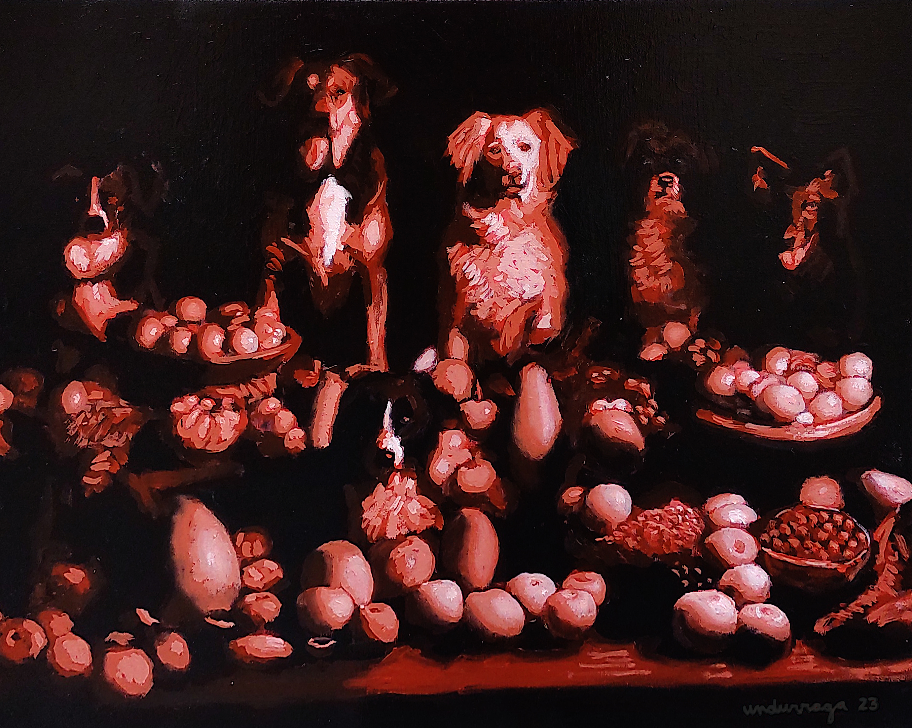

# gregorioundurraga.com

## About

gregorioundurraga.com is a personal website showcasing the oil paintings of Gregorio Undurraga.

## Features

### Multilingual Support

The website caters to a global audience, offering content in English, Spanish, French, Portuguese, Italian, German, and Japanese. Visitors can easily switch between these languages for a seamless browsing experience.

### Painting Gallery

The site features a selection of Gregorio Undurraga's oil paintings, including:

_The Natural Order of Things, 2024_

_The Fruitful Life of Dogs, 2023_

_The Race, 2017_

## License

This project is licensed under the MIT License. All paintings featured on the website are in the public domain by the choice of the artist. You may copy, modify, distribute and perform the work, even for commercial purposes, all without asking for permission.

---

gregorioundurraga.com aims to present Gregorio Undurraga's oil paintings to a global audience through a simple, accessible platform.
